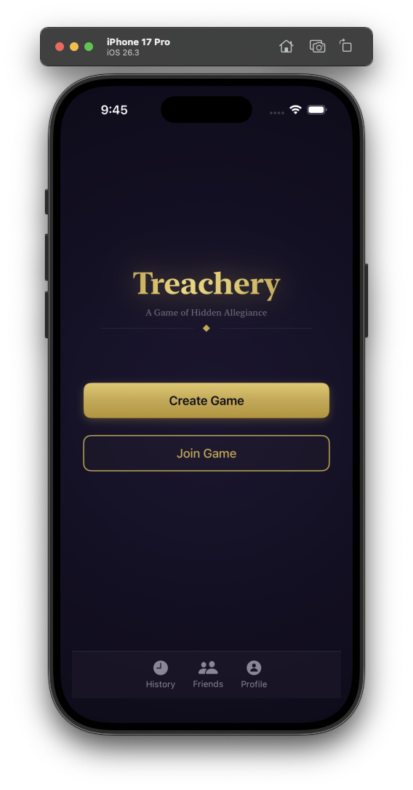
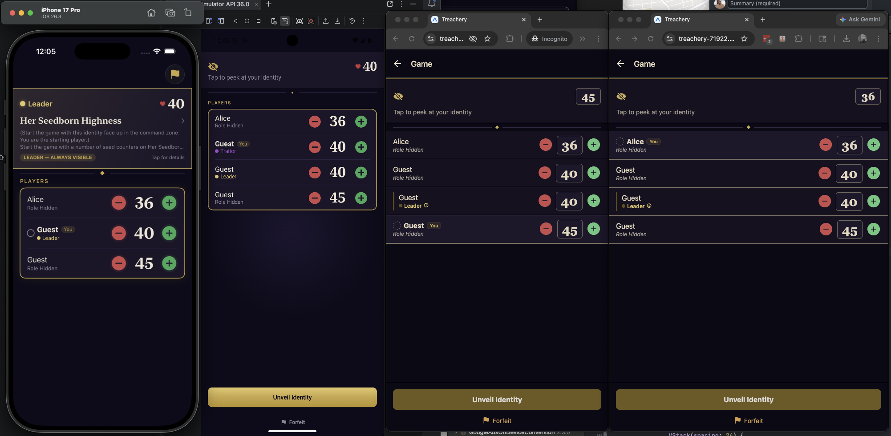

# Treachery

A companion app for the [MTG Treachery](https://mtgtreachery.net) format — a multiplayer Magic: The Gathering variant built around hidden roles, secret allegiances, and dramatic reveals.

Currently running live at https://treachery-71922.web.app/ - check it out! No signup required.

Available as a **native iOS app**, **native Android app**, and a **web app** hosted on Firebase.

## Screenshots

<p align="center">
  
</p>

<p align="center">
  
</p>

## What is Treachery?

Treachery is a multiplayer MTG format (4–8 players) where each player is secretly assigned a role:

- **Leader** (gold) — Known to all. Must survive.
- **Guardian** (blue) — Secretly protects the Leader.
- **Assassin** (red) — Wants to eliminate the Leader.
- **Traitor** (purple) — Plays both sides; wins by being the last one standing.

Each player also receives a secret **Identity Card** with a unique unveil ability that triggers when they reveal their role.

## Features

- **Real-time multiplayer** — Create or join games with a short game code
- **Life tracking** — Tap +/- to adjust any player's life total, synced in real-time with optimistic updates
- **Role & identity assignment** — Automatic role distribution and identity card dealing based on player count
- **Unveil mechanic** — One-time reveal of your identity to activate your card's ability
- **Elimination & win detection** — Automatic win condition checking when players are eliminated
- **62 identity cards** — 13 Leaders, 18 Guardians, 18 Assassins, 13 Traitors
- **Friends system** — Add friends and invite them to games
- **Game history** — View past games and results
- **Multiple auth methods** — Email/password, phone number, or guest sign-in

## Tech Stack

### iOS App (`Treachery-iOS/`)
- SwiftUI, iOS 18.0+, Swift 5
- Firebase Auth, Firestore, Cloud Functions, Crashlytics
- MVVM architecture with async/await

### Android App (`TreacheryAndroid/`)
- Kotlin, Jetpack Compose, Android 9+ (API 28)
- Firebase Auth, Firestore, Cloud Functions, Messaging, Analytics
- MVVM architecture with Hilt DI, Coroutines, and StateFlow

### Web App (`Treachery/`)
- Expo 55 / React Native 0.83 / React 19
- TypeScript
- Firebase JS SDK 12
- Expo Router (file-based routing)
- Hosted on Firebase Hosting

### Backend (`functions/`)
- Firebase Cloud Functions (Node.js 22)
- Handles game creation, role assignment, life adjustment, elimination, and win detection
- Firestore for real-time data sync

## Project Structure

```
├── Treachery-iOS/       # Native iOS app (SwiftUI)
│   └── Treachery-iOS/
│       └── Treachery-iOS/
│           ├── Auth/        # Login, signup, phone auth
│           ├── Home/        # Game board, lobby, history, profile
│           ├── Models/      # Game, Player, Role, IdentityCard
│           ├── Managers/    # Firebase & Firestore services
│           └── Resources/   # Identity cards JSON
├── TreacheryAndroid/    # Native Android app (Jetpack Compose)
│   └── app/src/main/java/com/solomon/treachery/
│       ├── ui/auth/     # Login, signup, forgot password
│       ├── ui/home/     # Create game, join game
│       ├── ui/lobby/    # Game lobby with real-time sync
│       ├── ui/game/     # Game board, identity cards, planechase
│       ├── ui/profile/  # Profile, friends, game history
│       ├── model/       # Game, Player, Role, IdentityCard
│       └── data/        # Firebase repositories & DI
├── Treachery/           # Web app (Expo/React Native)
│   ├── app/             # File-based routes
│   └── src/             # Components, hooks, services, models
├── functions/           # Firebase Cloud Functions
├── firebase.json        # Firebase project config
└── firestore.rules      # Firestore security rules
```

## Getting Started

### Prerequisites
- Xcode 16+ (for iOS)
- Android Studio + JDK 17 (for Android)
- Node.js 22+ (for web and Cloud Functions)
- Firebase CLI (`npm install -g firebase-tools`)
- A Firebase project with Auth, Firestore, and Cloud Functions enabled

### iOS
1. Open `Treachery-iOS/Treachery-iOS.xcodeproj` in Xcode
2. Add your `GoogleService-Info.plist` to the project
3. Build and run on a simulator or device

### Android
1. Open `TreacheryAndroid/` in Android Studio
2. Add your `google-services.json` to `TreacheryAndroid/app/`
3. Build and run on an emulator or device

### Web
```bash
cd Treachery
npm install
npx expo start --web
```

### Cloud Functions
```bash
cd functions
npm install
firebase deploy --only functions
```

### Deploy Web to Firebase Hosting
```bash
cd Treachery
npx expo export --platform web
cd ..
firebase deploy --only hosting
```

## Game Flow

1. **Create a game** — Host picks player count and starting life total
2. **Share the code** — Other players join with a 4-character game code
3. **Start the game** — Host starts when enough players have joined; roles and identity cards are assigned
4. **Play** — Track life totals, strategize, and figure out who's who
5. **Unveil** — Reveal your identity at the right moment to activate your card's ability
6. **Win** — Eliminate your enemies before they eliminate you
