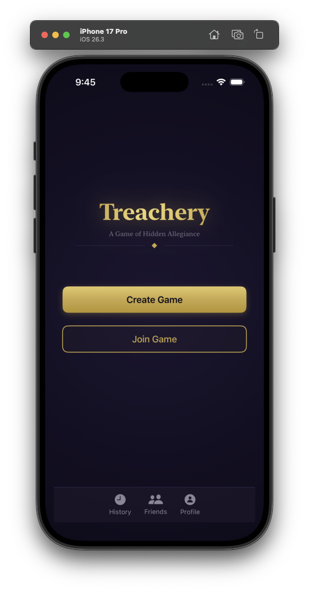
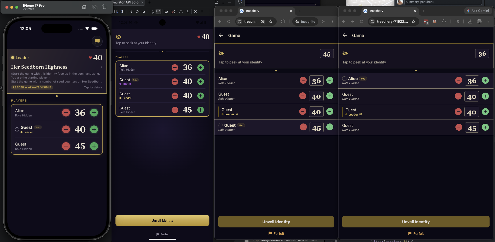

# Treachery

A companion app for the [MTG Treachery](https://mtgtreachery.net) format — a multiplayer Magic: The Gathering variant built around hidden roles, secret allegiances, and dramatic reveals.

Currently running live at [treachery.games](https://treachery.games/) - check it out! No signup required.
Staging environment is [treachery-staging.web.app](https://treachery-staging.web.app/)

Available as a **native iOS app**, **native Android app**, and a **web app** hosted on Firebase.

## Screenshots

<p align="center">
  
</p>

<p align="center">
  
</p>

## What is Treachery?

Treachery is a multiplayer MTG format (4–8 players) where each player is secretly assigned a role:

- **Leader** (gold) — Known to all. Must survive.
- **Guardian** (blue) — Secretly protects the Leader.
- **Assassin** (red) — Wants to eliminate the Leader.
- **Traitor** (purple) — Plays both sides; wins by being the last one standing.

Each player also receives a secret **Identity Card** with a unique unveil ability that triggers when they reveal their role.

## Features

- **Real-time multiplayer** — Create or join games with a short game code
- **Life tracking** — Tap +/- to adjust any player's life total, synced in real-time with optimistic updates
- **Role & identity assignment** — Automatic role distribution and identity card dealing based on player count
- **Unveil mechanic** — One-time reveal of your identity to activate your card's ability
- **Traitor abilities** — Server-resolved unveil effects for the Metamorph, Puppet Master, and Wearer of Masks
- **Elimination & win detection** — Automatic win condition checking when players are eliminated
- **62 identity cards** — 13 Leaders, 18 Guardians, 18 Assassins, 13 Traitors
- **Game settings** — Max players, starting life, game mode, and a max traitor rarity cap for the random pool (rarity selector currently web-only; the backend supports all clients)
- **Planechase mode** — Shared planar deck, die rolls with chaos/planeswalk resolution, phenomena — playable standalone or combined with Treachery
- **Life Tracker mode** — Plain multiplayer life tracking for regular Commander games
- **ELO & deck stats** — Per-player and per-commander ratings updated when games finish
- **Push notifications** — Joins, game start, eliminations, and planeswalks via FCM
- **Friends system** — Add friends and invite them to games
- **Game history** — View past games and results
- **Multiple auth methods** — Email/password, phone number, or guest sign-in

## Tech Stack

### iOS App (`Treachery-iOS/`)
- SwiftUI, iOS 18.0+, Swift 5
- Firebase Auth, Firestore, Cloud Functions, Crashlytics
- MVVM architecture with async/await

### Android App (`TreacheryAndroid/`)
- Kotlin, Jetpack Compose, Android 9+ (API 28)
- Firebase Auth, Firestore, Cloud Functions, Messaging, Analytics
- MVVM architecture with Hilt DI, Coroutines, and StateFlow

### Web App (`Treachery/`)
- Expo 55 / React Native 0.83 / React 19
- TypeScript
- Firebase JS SDK 12
- Expo Router (file-based routing)
- Hosted on Firebase Hosting

### Backend (`functions/`)
- Firebase Cloud Functions (Node.js 22)
- Handles game creation, role assignment, life adjustment, elimination, and win detection
- Firestore for real-time data sync

## Project Structure

```
├── Treachery-iOS/       # Native iOS app (SwiftUI)
│   └── Treachery-iOS/
│       └── Treachery-iOS/
│           ├── Auth/        # Login, signup, phone auth
│           ├── Home/        # Game board, lobby, history, profile
│           ├── Models/      # Game, Player, Role, IdentityCard
│           ├── Managers/    # Firebase & Firestore services
│           └── Resources/   # Identity cards JSON
├── TreacheryAndroid/    # Native Android app (Jetpack Compose)
│   └── app/src/main/java/com/solomon/treachery/
│       ├── ui/auth/     # Login, signup, forgot password
│       ├── ui/home/     # Create game, join game
│       ├── ui/lobby/    # Game lobby with real-time sync
│       ├── ui/game/     # Game board, identity cards, planechase
│       ├── ui/profile/  # Profile, friends, game history
│       ├── model/       # Game, Player, Role, IdentityCard
│       └── data/        # Firebase repositories & DI
├── Treachery/           # Web app (Expo/React Native)
│   ├── app/             # File-based routes
│   ├── src/             # Components, hooks, services, models
│   └── e2e/             # Playwright suite + simulation harness + playtest tool
├── functions/           # Firebase Cloud Functions (all game logic)
│   └── test/            # Unit suite + integration suite vs. real callables
├── firestore-tests/     # Security-rules test suite (rules-unit-testing)
├── docs/                # TESTING, DEPLOYMENT, KNOWN-ISSUES
├── firebase.json        # Firebase project config
└── firestore.rules      # Firestore security rules (source of truth — never edit in console)
```

## Getting Started

### Prerequisites
- Xcode 16+ (for iOS)
- Android Studio + JDK 17 (for Android)
- Node.js 22+ (for web and Cloud Functions)
- Firebase CLI (`npm install -g firebase-tools`)
- A Firebase project with Auth, Firestore, and Cloud Functions enabled

### iOS
1. Open `Treachery-iOS/Treachery-iOS.xcodeproj` in Xcode
2. Add your `GoogleService-Info.plist` to the project
3. Build and run on a simulator or device

### Android
1. Open `TreacheryAndroid/` in Android Studio
2. Add your `google-services.json` to `TreacheryAndroid/app/`
3. Build and run on an emulator or device

### Web
```bash
cd Treachery
npm install
npx expo start --web
```

## Testing

Four automated layers run on every PR — functions unit + integration
(against the real callables), Firestore security rules, and a Playwright E2E
suite that includes a seeded multi-player simulation/fuzz harness. Known bugs
are tracked as *skipped tests asserting the correct behaviour*, so the suites
double as an executable backlog.

```bash
cd functions && npm test                  # unit (~2s)
cd functions && npm run test:integration  # real callables vs emulator (~70s)
cd firestore-tests && npm test            # security rules (~3s)
cd Treachery && npm run test:e2e          # browsers + simulation (~2min, needs Java 21+)
```

To playtest by hand without opening four browsers, `cd Treachery && npm run
playtest` opens one signed-in window per player already seated in a game.

Details, fuzzing knobs, and the skip convention: [docs/TESTING.md](docs/TESTING.md)

## Deployment

Push to `main` auto-deploys the **staging** web app plus the *shared*
functions/rules; publishing a GitHub release promotes to production (web +
App Store + Play). Staging and production share one Firebase project, so
backend changes reach production users immediately — the full pipeline map
and its implications: [docs/DEPLOYMENT.md](docs/DEPLOYMENT.md)

Current bug backlog and audit findings: [docs/KNOWN-ISSUES.md](docs/KNOWN-ISSUES.md)

## Game Flow

1. **Create a game** — Host picks player count and starting life total
2. **Share the code** — Other players join with a 4-character game code
3. **Start the game** — Host starts when enough players have joined; roles and identity cards are assigned
4. **Play** — Track life totals, strategize, and figure out who's who
5. **Unveil** — Reveal your identity at the right moment to activate your card's ability
6. **Win** — Eliminate your enemies before they eliminate you
